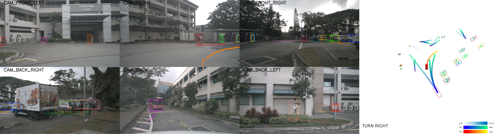

参考：[chargerkong.github.io/2023/12/24/20231224 uniad/](http://chargerkong.github.io/2023/12/24/20231224%20uniad/)

从流程上看， 首先将环视的 相机/雷达/激光雷达 拍摄的 图像数据 或 点云数据 以 Transformer 映射到 BEV 空间供后续模块使用。TrackFormer 根据 Bev 信息进行推理， 融合了检测和跟踪任务， 输出为目标检测和跟踪的信息；MapFormer 根据 BEV 信息给出实时地图构建结果；之后 Motion Former 将 TrackerFormer 的结果和 MapFormer 的结果和 Bev 结果进行融合，最后得出周围物体整体轨迹和预测。这些信息会作为 OccFormer 的输入， 再次与 Bev 特征融合作为占据栅格网络预测的输入。Planner 的目标是防止本车与占据栅格碰撞，作为整个大模块的最终输出。

具体到推理阶段，UniAD 通常需要以下几类输入：

### 输入格式和数据

1. **多角度 相机/雷达/激光雷达 数据**：
    - **图像数据**：通常为 RGB 或 灰度图像，格式可能为 `jpg` 或 `png`。
    - **点云数据**：来自 雷达 或 激光雷达 的 3D 点云数据，示例格式为 `pcd` 或 `pcd.bin`，包含每个点的XYZ坐标和可能的反射率（intensity）等信息。
    
    这些数据有指定时刻的关键帧，也有持续扫描的上下文前后帧，以捕捉更多动态变化，首先通过基于 Transformer 的网络 映射到 BEV（鸟瞰图）空间，供后续模块使用。
    

### 中间处理及其输出

1. **TrackFormer**：
    - **输入**：BEV空间的特征图。
    - **输出**：目标检测和跟踪的结果，包括每个目标的位置、速度、跟踪ID等信息。
2. **MapFormer**：
    - **输入**：BEV空间的特征图。
    - **输出**：实时地图构建结果，如道路边界、车道线等地图特征。
3. **MotionFormer**：
    - **输入**：TrackFormer 和 MapFormer 的输出结果。
    - **输出**：融合后的周围物体轨迹和运动预测。

### 最终输出

1. **OccFormer**：
    - **输入**：MotionFormer 的输出 和 BEV特征。
    - **输出**：占据栅格（occupancy grid）预测，表示空间中可能被占据的区域。
2. **Planner**：
    - **输入**：OccFormer 的输出。
    - **输出**：避免与占据栅格碰撞的驾驶决策，如转向角度、速度调整等，确保车辆安全行驶。

### 可视化展示

**右侧为合成BEV地图视角，左侧为相机视角；**

没有精确到车身控制本身，但有转向角度，速度等细节信息的预测。
在可视化代码提供的write_agent_details_to_file函数中，各种输出项被设计为保存有关自动驾驶车辆及其环境的详细信息。这些数据由UniAD的预测模型输出，通常包括车辆的位置、尺寸、速度等关键参数，用于场景理解和导航。

**各个输出的详细解释：**

以下是 `AgentPredictionData` 类中各数据属性的含义：

1. **`pred_score`**:
    - **含义**：预测得分，通常表示模型对于该预测标签的置信度。
    - **数据类型**：通常为浮点数，范围从 0 到 1。
2. **`pred_label`**:
    - **含义**：预测的类别标签，如车辆、行人等。
    - **数据类型**：整数或字符串，取决于类别的编码方式。
3. **`pred_center`**:
    - **含义**：预测物体的中心坐标，通常为三维空间中的点。
    - **数据类型**：三元组浮点数 (x, y, z)。
4. **`pred_dim`**:
    - **含义**：预测物体的尺寸，包括长度、宽度和高度。
    - **数据类型**：三元组浮点数 (length, width, height)。
5. **`pred_yaw`**:
    - **含义**：预测物体的偏航角，即物体在水平面上的旋转角度。
    - **数据类型**：浮点数，通常为弧度制。
6. **`pred_vel`**:
    - **含义**：预测物体的速度，通常包括水平方向的两个分量。
    - **数据类型**：二元组浮点数 (vx, vy)。
7. **`pred_traj`**:
    - **含义**：预测的轨迹，即物体未来一段时间内的预计移动路径。
    - **数据类型**：二维数组，其中每一行代表一个时间点的空间坐标。
8. **`pred_traj_score`**:
    - **含义**：预测轨迹的得分，可以是单一得分或与轨迹每个点相对应的得分。
    - **数据类型**：单一浮点数或浮点数数组。
9. **`pred_track_id`**:
    - **含义**：跟踪标识，用于跟踪场景中的同一物体。
    - **数据类型**：整数或空值（如果不适用）。
10. **`pred_occ_map`**:
    - **含义**：占用图，表示物体在空间中占用的区域，通常用于更精确的位置判断。
    - **数据类型**：二维数组或空值（如果不适用）。
11. **`is_sdc`** (Self-Driving Car):
    - **含义**：标记是否为自驾车。
    - **数据类型**：布尔值。
12. **`past_pred_traj`**:
    - **含义**：过去的预测轨迹，用于显示物体之前的移动路径。
    - **数据类型**：二维数组或空值（如果不适用）。
13. **`command`**:
    - **含义**：给自驾车的指令，如转向或加速。
    - **数据类型**：字符串或空值（如果不适用）。
14. **`attn_mask`**:
    - **含义**：注意力掩码，用于模型内部计算，标示重要的输入部分。
    - **数据类型**：数组或空值（如果不适用）。

### **以 Nusense 为例进行验证：**

UniAD 进行 nuscenes 数据集的验证时，一般进行四个任务：**Tracking**（跟踪）、**Motion**（运动估计）、**Occupancy Prediction**（占用预测/检测）和 **Planning**（规划），以下是详细介绍：

1. **传感器数据**：
    - 从 `samples` 和 `sweeps` 目录中提取的数据，这些目录包含来自多个传感器的关键帧和连续扫描数据。
    - 对于验证和推理，通常首先使用 `samples` 中的关键帧数据，这些数据对应于场景中预定义的关键时间点。这些关键帧数据包括摄像头图像、激光雷达点云和雷达点云。
    - 在某些应用中，可能还会用到 `sweeps` 中的连续扫描数据以增强时序上的信息，例如在进行运动估计或轨迹预测时。
2. **车辆和传感器的定位数据**：
    - 使用 `ego_pose.json` 中的数据获取车辆在世界坐标系中的位置和旋转信息。
    - 使用 `calibrated_sensor.json` 中的数据了解各传感器相对于车辆的精确位置和方向，确保数据的正确解释和传感器数据融合。
3. **地图数据**：
    - 尽管地图数据（`maps` 目录）在某些任务中可能不是必需的，但它提供了驾驶环境的额外上下文，有助于进行路径规划、导航和环境理解等高级任务。
4. **元数据和索引信息**：
    - 利用 `scene.json`、`sample.json` 和 `sample_data.json` 等文件中的信息，可以关联并索引到场景中特定时间点的具体传感器数据。
    - 这些文件包含样本数据的时间戳、关键帧标识、以及与其他数据（如 `ego_pose` 和校准传感器）的关联信息，这些都是执行时间序列分析或场景重建时不可或缺的。
5. **扩展数据（如 can_bus 数据）**：
    - 在某些高级应用中，如驾驶行为分析或详细的物理模拟，可能还需要从 `can_bus` 目录获取车辆的底层运动和状态数据，如速度、加速度、转向角度等。